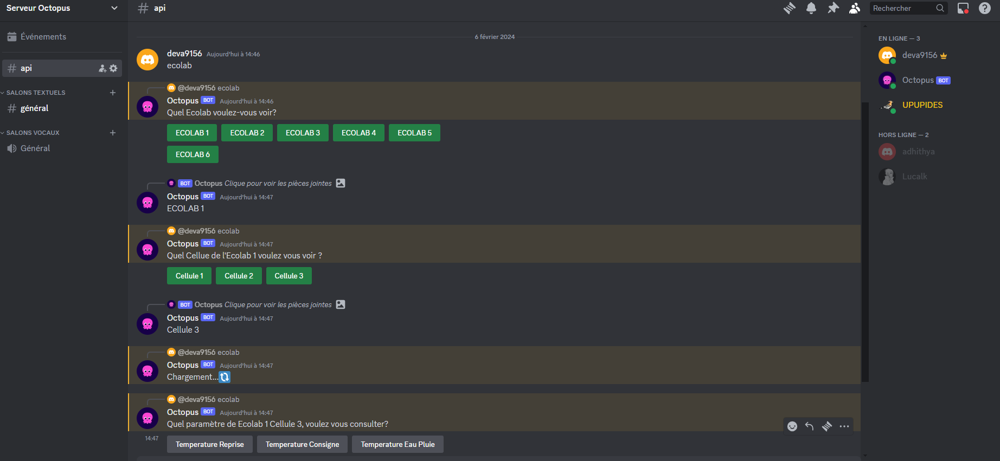

= Project Octopus
:toc-title: Tables des matières
:toc: top
:toclevels: 6

<<<<

== Contexte:
[.text-justify]
****

Le projet Octopus a été crée dans le but de faciliter
la surveillance des expériences menées dans les cellules
climatiques (ECOLAB). Il offre des fonctionnalités telles que
la consultation à distance et un système d'alerte pour suivre
le déroulement des expériences.
****

== Architecture systéme

image::img/structure-du-projet.png[]

NOTE: Voici un schéma illustrant la structure de
notre projet. Les blocs en vert représentent les
éléments intégrés à notre projet Octopus, tandis
que les blocs en bleu ont déjà été réalisés par
Mr. chollet

-----
Systèm de pilotage et d'aquisition des actionneurs et capteurs des chambres climatiques.L'automate est autonome : il régle les chambresclimatique selon des cosignes.
-----

----
Système de généralisation de climats qui permet de générer des fichiers contenant les variations de paramétre de climat : temperature hygrométrie consentration de CO2, etc...

Le générateur de climat transforme des clonnées météo provenant de différenes stations dans le format supporté par les chambres climatiques.
----
image::img/Apirest.png[width=100,height=50]
----
Le serveur API REST permet au serveur web de récupérer des paramètres de température en temps réel au format JSON
----

----
Le serveur de base de données permet d'avoir une sauvegarde des expériences en cours et terminées dans les cellules, tout en gérant les rôles des utilisateurs.
----

----
Le serveur web est une interface permettant aux clients de consulter les écolabs à distance. Ils peuvent vérifier les températures actuelles des cellules, ainsi que leurs expériences. Les administrateurs ont la possibilité de modifier ou d'ajouter des expériences à distance.
----

----
Système de surveillance qui permet de prévenir le personnel en cas de défaillance sur le déroulement d'une expérience.

Le watchdog surveille les paramètres climatiques et permet d'envoyer des messages sous forme de SMS.
----

----
Les bots ont un rôle de communication avec les clients, échangeant des informations. Les utilisateurs peuvent demander au bot la température actuelle d'une cellule ou solliciter le lien de notre site web.
Dans le cadre de ce projet, nous avons codé un bot Discord.
----

=== API REST
[source,text]
----
Une API REST repose sur des principes fondamentaux incluant l'architecture orientée ressources avec des identifiants URI, la représentation des données en JSON ou XML, la communication via les méthodes HTTP standard (GET, POST, PUT, DELETE), le principe de communication sans état, et une interface uniforme définissant des conventions pour les URI, les méthodes HTTP et les représentations des ressources.
----
==== Principes de bases
* Architecture Orientée Ressources : Identification des éléments par des URI.
* Représentation des Données : Utilisation de formats standard (JSON, XML) pour représenter les ressources.
* Méthodes HTTP Standard : Utilisation des méthodes GET, POST, PUT, DELETE pour interagir avec les ressources.
* Communication Sans État : Chaque requête contient toutes les informations nécessaires, et le serveur ne garde pas d'état entre les requêtes.
* Interface Uniforme : Définition de conventions pour les URI, les méthodes HTTP et les représentations des ressources.

NOTE: Dans ce projet, nous avons utilisé uniquement les méthodes HTTP *GET* en format *JSON*

==== Arborescence :
----
├───.idea
│       encodings.xml
│       misc.xml
│       modules.xml
│       Octopus.iml
│       workspace.xml
│
├───Commons
│   │   __init__.py
│   │
│   ├───Config
│   │   │   config.py
│   │   │   config_json.py
│   │   │   __init__.py
│   │
│   └───__pycache__
│           __init__.cpython-38.pyc
│
├───config
│   │   climate_settings.json
│   │   errors.json
│   │
│   ├───ECOLAB_1 ... (tout les fichier json qui contient les parametre adapter pour interroger l'automate )
│   │       E1C1.json
│   │       E1C2.json
│   │       E1C3.json
│   │       E1TH.json
│   │       ECOLAB_1.json
│   │
│   ├───ECOLAB_2 ... (tout les fichier json qui contient les parametre adapter pour interroger l'automate )
│   │       E2C1.json
│   │       E2C2.json
│   │       E2C3.json
│   │       E2TH.json
│   │       ECOLAB_2.json
│   │
│   ├───ECOLAB_3 ... (tout les fichier json qui contient les parametre adapter pour interroger l'automate )
│   │       E3C1.json
│   │       E3C2.json
│   │       E3C3.json
│   │       E3TH.json
│   │       ECOLAB_3.json
│   │
│   ├───ECOLAB_4 ... (tout les fichier json qui contient les parametre adapter pour interroger l'automate )
│   │       E4C1.json
│   │       E4C2.json
│   │       E4C3.json
│   │       E4TH.json
│   │       ECOLAB_4.json
│   │
│   ├───ECOLAB_5 ... (tout les fichier json qui contient les parametre adapter pour interroger l'automate )
│   │       E5C1.json
│   │       E5C2.json
│   │       E5C3.json
│   │       E5TH.json
│   │       ECOLAB_5.json
│   │
│   └───ECOLAB_6 ... (tout les fichier json qui contient les parametre adapter pour interroger l'automate )
│           E6C1.json
│           E6C2.json
│           E6C3.json
│           E6TH.json
│           ECOLAB_6.json
│   api.py ... (Programme Python qui récupère et retourne les API)
│   base_error.py
│   cell.py ... (Class Cell)
│   climate_settings.py
│   config.json
│   E1C1.json
│   ecolab.py
│   plc.py
│   thermo.py
----

==== Comment Interroger les APIs des Ecolabs ?

[source,text]
----
Chaque écolab est identifié par une adresse IP. Lorsqu'on interroge l'adresse IP de l'écolab, elle renvoie les paramètres des cellules qu'elle contient.
----

==== Routage :

****
Le fichier *api.py* contient deux routages. Le premier routage à la racine renvoie tous les paramètres de toutes les cellules de l'écolab. Le deuxième routage retourne uniquement le paramètre souhaité d'une seule cellule.
****

<<<<

=== DB : Data Base
==== Structure de la Base de données :

==== Comment Communiquer avec la Base de Donnée ?
----
Lorsque vous souhaitez communiquer avec la base de données du serveur DB, il suffit d'ajouter l'adresse IP du serveur DB devant l'utilisateur.
----

=== Web

==== Arborescence
11 directories, 87 files
----
├── Doc.adoc
├──Img
│   ├──adminT.jpg
│   ├──Connexion.jpg
│   ├──Détails.jpg
│   ├──Expériences.jpg
│   ├──Index.jpg
│   ├──Utilisateurs.jpg
├── ImgResponsive
│   ├── Cells.py (Classe Cellule)
│   ├── config.json
│   ├── Connexion.py (Paramètre de connexion DB)
│   ├── EcolabWeb.py (Classe Ecolab)
│   ├── Experiment.py (Classe Experience)
│   ├── History.py (Classe Historique)
│   ├── init_db.py (Tests)
│   ├── OctopusDB.py (Classe OctopusDB contenant toutes les fonctions)
│   ├── OctopusWeb.py (Toutes les routes concernant les templates : WEB)
│   ├── __pycache__
│   │   ├── Cells.cpython-310.pyc
│   │   ├── Connexion.cpython-310.pyc
│   │   ├── EcolabWeb.cpython-310.pyc
│   │   ├── Experiment.cpython-310.pyc
│   │   ├── History.cpython-310.pyc
│   │   ├── OctopusDB.cpython-310.pyc
│   │   └── User.cpython-310.pyc
│   ├── static
│   │   ├── images
│   │   │   ├── CNRSlogo.svg
│   │   │   ├── DJI_0884.JPG
│   │   │   ├── Ecolabs.png
│   │   │   ├── imgmobil2.png
│   │   │   └── logo-footer.svg
│   │   ├── index.css (CSS de l'index)
│   │   ├── responsive.js (Pour l'index)
│   │   └── style.css (CSS des autres templates)
│   ├── templates
│   │   ├── addExperience.html (Ajouter une expérience)
│   │   ├── adminTemplate.html (Template de l'admin)
│   │   ├── allUsers.html (Liste des utilisateurs)
│   │   ├── connection.html (Template de connexion)
│   │   ├── detail.html (Template de détails d'une cellule)
│   │   ├── editExperience.html (Modification d'une expérience)
│   │   ├── editRole.html (Modification de rôle d'utilisateur)
│   │   ├── experience.html (Liste des expériences)
│   │   ├── index.html (Index normal)
│   │   ├── inscription.html (Template d'inscription)
│   │   ├── noAccess.html (Message de non-accès)
│   │   ├── successAddExperienceInCellule.html (Message de réussite d'action)
│   │   └── successAddNewExperience.html (Message de réussite d'action)
│   └── User.py (Classe Utilisateur)
└── Octopus
    ├── Cells.py (Classe Cellule)
    ├── config.json
    ├── Connexion.py (Paramètre de connexion DB)
    ├── EcolabWeb.py (Classe Ecolab)
    ├── Experiment.py (Classe Experience)
    ├── History.py (Classe Historique)
    ├── init_db.py (Tests)
    ├── OctopusDB.py (Classe OctopusDB contenant toutes les fonctions)
    ├── OctopusWeb.py (Toutes les routes concernant les templates : WEB)
    ├── __pycache__
    │   ├── Cells.cpython-310.pyc
    │   ├── Cellule.cpython-310.pyc
    │   ├── Connexion.cpython-310.pyc
    │   ├── Ecolab.cpython-310.pyc
    │   ├── EcolabWeb.cpython-310.pyc
    │   ├── Experience.cpython-310.pyc
    │   ├── Historique.cpython-310.pyc
    │   ├── History.cpython-310.pyc
    │   ├── OctopusDB.cpython-310.pyc
    │   └── User.cpython-310.pyc
    ├── static
    │   ├── images
    │   │   ├── CNRSlogo.svg
    │   │   ├── Ecolabs.png
    │   │   ├── icons8-flèche-vers-le-haut-100.png
    │   │   ├── icons8-flèche-vers-le-haut-50.png
    │   │   ├── logo-footer.svg
    │   │   └── logo.svg
    │   ├── index.css (CSS de l'index)
    │   └── style.css (CSS des autres templates)
    ├── templates
    │   ├── addExperience.html (Ajouter une expérience)
    │   ├── adminTemplate.html (Template de l'admin)
    │   ├── allUsers.html (Liste des utilisateurs)
    │   ├── connection.html (Template de connexion)
    │   ├── detail.html (Template de détail d'une cellule)
    │   ├── editExperience.html (Modification d'une expérience)
    │   ├── editRole.html (Modification de rôle d'utilisateur)
    │   ├── experience.html (Liste des expériences)
    │   ├── index.html (Index normal)
    │   ├── inscription.html (Template d'inscription)
    │   ├── noAccess.html (Message de non-accès)
    │   ├── successAddExperienceInCellule.html (Message de réussite d'action)
    │   └── successAddNewExperience.html (Message de réussite d'action)
    └── User.py (Classe Utilisateur)

----

==== Schémas:
----
Ce schéma représente les actions de pouvant être effectuées à partir de cet route, qui est l'index de base.
----

Connexion

----
Ce schéma représente le procéssus qui est fait lors d'une connexion d'utilisateur.
----

Admin

----
Ce schéma représente les actions de pouvant être effectuées à partir de cet route, qui est l'index admin.
Elle est accessible uniquement lorsque l'utilisateur connecté possède le rôle admin.
----

Détails

----
Ce schéma représente la page web detail ainsi que les actions réalisables sur cette page.
Lorsqu'un utilisateur clique sur une cellule à partir de l'index admin, cette route est activée pour diriger vers la page detail.
Cette page affiche des informations supplémentaires sur la cellule concernée.
----

image::img/Détails.jpg[]

Expériences

----
Ce schéma représente la page des Expériences ainsi que les actions possibles sur cette page.
Elle redirige vers une page affichant toutes les expériences présentes dans la base de données.
De plus, elle permet la modification d'une expérience (date, nom, état, etc.) ainsi que l'ajout d'une nouvelle expérience.
----

Utilisateurs

----
Ce schéma représente la page des Utilisateurs ainsi que les actions possibles sur cette page.
Elle redirige vers une page affichant tous les utilisateurs présents dans la base de données.
De plus, elle permet la modification du rôle d'un utilisateur (par exemple, administrateur, utilisateur normal) et d'autres informations liées à leur compte.
----

=== Bot Octopus:

****
Le bot Octopus est présent dans le salon API du serveur Octopus sur Discord.
****
==== Arborescence
----
│   api.py
│   bot.py
│   key.py
│   Liens.json
│
└───__pycache__
        api.cpython-311.pyc
        key.cpython-311.pyc
----

==== Les Commands :
Voici la liste des commandes qui vous permettent de communiquer avec le bot :

==== Exemples :

